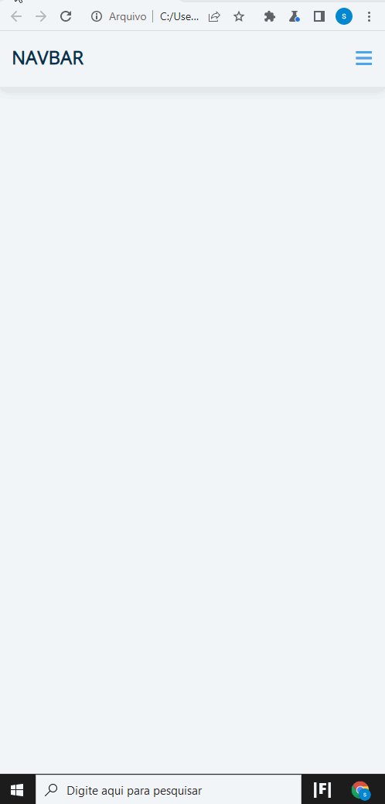

## Navbar
- Neste projeto foi estudado como usar Javascript, para manipular DOM ao incluir e remover classes na navegação usando Toggle
- Utilizando tecnologias simples como HTML5, CSS3 e JavaScript.
- A partir de projeto FreeCodeCamp.
 
 

  
</p
